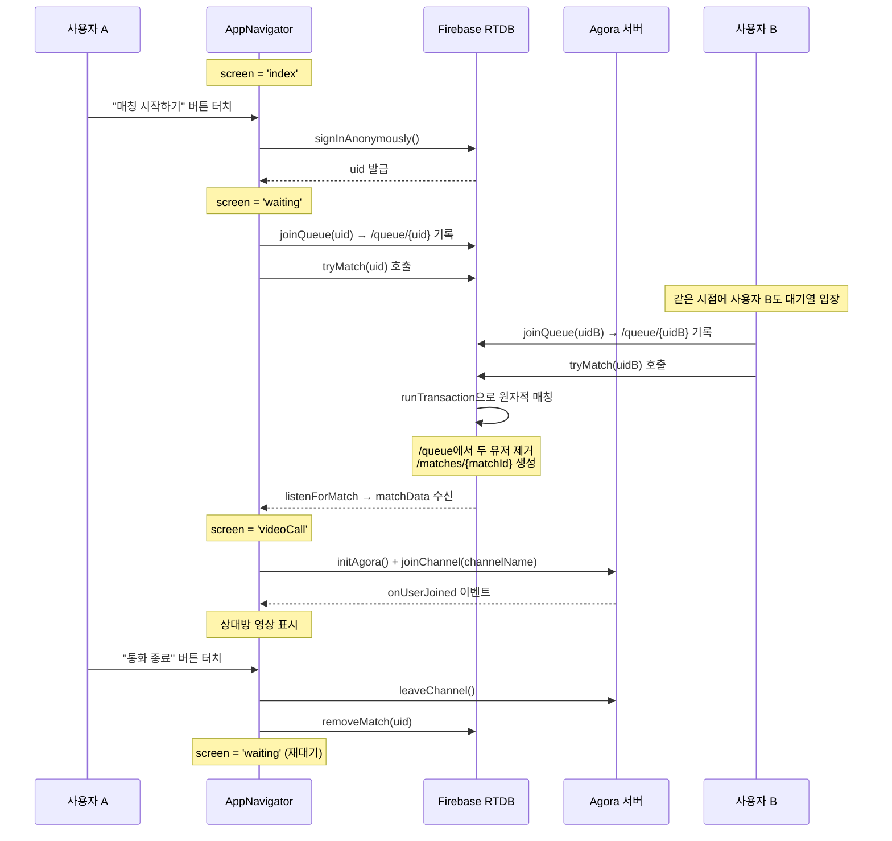

# PrinParty 프로젝트 구성 및 E2E 동작 흐름

## 프로젝트 구조

```
prinparty/
  App.tsx                          # 앱 진입점 (SafeAreaProvider 감싸기)
  src/
    navigation/
      AppNavigator.tsx             # 화면 전환 컨트롤러 (useState 기반)
    screens/
      IndexScreen.tsx              # 1단계: 시작 화면 (익명 로그인)
      WaitingScreen.tsx            # 2단계: 매칭 대기 화면
      VideoCallScreen.tsx          # 3단계: 영상통화 화면
    services/
      matchingService.ts           # 매칭 비즈니스 로직 (Firebase RTDB)
      agoraService.ts              # 영상통화 엔진 (Agora SDK + 토큰 생성)
    config/
      firebase.ts                  # Firebase 초기화 설정
    constants/
      colors.ts                    # 디자인 시스템 (색상, 타이포, 간격, 그림자)
```

### 핵심 기술 스택


| 역할     | 기술                                   |
| ------ | ------------------------------------ |
| 프레임워크  | Expo (React Native) + TypeScript     |
| 인증     | Firebase Anonymous Auth              |
| 실시간 DB | Firebase Realtime Database           |
| 영상통화   | Agora.io SDK (`react-native-agora`)  |
| 화면 전환  | `useState<Screen>` (expo-router 미사용) |
| 아이콘    | `@expo/vector-icons` (Ionicons)      |


---

## E2E 동작 흐름 (사용자 관점)

### 전체 흐름 다이어그램




---

### 1단계: IndexScreen (시작 화면)

`App.tsx`가 `SafeAreaProvider`로 감싼 `AppNavigator`를 렌더링합니다.

```tsx
// AppNavigator가 screen 상태를 'index'로 초기화
const [screen, setScreen] = useState<Screen>('index');
```

사용자가 **"매칭 시작하기"** 버튼을 누르면:

```tsx
const handleStart = async () => {
  setLoading(true);
  try {
    const userCredential = await signInAnonymously(auth);
    const uid = userCredential.user.uid;
    onStart(uid);
  } catch (error) {
    console.error('익명 로그인 실패:', error);
    setLoading(false);
  }
};
```

- Firebase **익명 인증**으로 uid를 발급받고
- `onStart(uid)` 콜백이 AppNavigator의 `handleStart`를 호출
- `screen`이 `'waiting'`으로 변경됩니다

---

### 2단계: WaitingScreen (매칭 대기)

화면이 마운트되면 두 가지가 동시에 실행됩니다:

```tsx
useEffect(() => {
  // 대기열 입장
  joinQueue(uid, recentContacts).catch(console.error);

  // 매칭 리스닝
  const unsubscribe = listenForMatch(uid, (matchData) => {
    if (matchData && !matchFoundRef.current) {
      matchFoundRef.current = true;
      onMatched(matchData);
    }
  });

  return () => {
    unsubscribe();
    if (!matchFoundRef.current && !cancelledRef.current) {
      leaveQueue(uid).catch(console.error);
    }
  };
}, [uid]);
```

#### 2-1) `joinQueue(uid)` - 대기열 입장 + 매칭 시도

```tsx
export async function joinQueue(uid: string, recentContacts: string[] = []): Promise<void> {
  const userQueueRef = ref(db, `queue/${uid}`);
  await set(userQueueRef, {
    uid,
    joinedAt: Date.now(),
    recentContacts,
  });
  // 대기열에 2명 이상이면 자동 매칭 시도
  await tryMatch(uid);
}
```

- Firebase RTDB의 `/queue/{uid}` 경로에 유저 정보를 기록합니다
- 바로 `tryMatch(uid)`를 호출해 매칭을 시도합니다

#### `tryMatch`의 핵심 - 원자적 매칭 (race condition 방지)

```tsx
const { committed } = await runTransaction(queueRef, (queue) => {
  // ... 대기열에서 joinedAt 기준 정렬
  // ... 현재 유저와 매칭 가능한 상대 탐색 (recentContacts 양방향 체크)
  // ... 두 유저를 대기열에서 원자적 제거
  return newQueue;
});

if (committed && matchedUser1 && matchedUser2) {
  // /matches/{matchId}에 매치 데이터 생성
  await set(matchRef, { user1, user2, channelName, createdAt });
}
```

- `runTransaction`이 `/queue` 전체를 원자적으로 수정하므로, 두 사용자가 동시에 `tryMatch`를 호출해도 **한 쪽만 성공**합니다
- 최근 3번 만난 상대는 `recentContacts` 양방향 체크로 제외합니다

#### 2-2) `listenForMatch(uid)` - 매칭 결과 실시간 감시

```tsx
export function listenForMatch(
  uid: string,
  callback: (matchData: MatchData | null) => void
): () => void {
  const matchesRef = ref(db, 'matches');

  const listener = onValue(matchesRef, (snapshot) => {
    // /matches에서 자신의 uid가 포함된 매치를 찾으면 callback 호출
  });

  return () => off(matchesRef, 'value', listener);
}
```

- `/matches` 노드를 실시간 구독해서, 자신이 포함된 매치가 생기면 `onMatched(matchData)` 콜백을 실행합니다
- AppNavigator가 `screen`을 `'videoCall'`로 전환합니다

---

### 3단계: VideoCallScreen (영상통화)

화면이 마운트되면 Agora 엔진이 초기화되고 채널에 입장합니다:

```tsx
const startCall = async () => {
  const engine = initAgora();
  // ... 이벤트 핸들러 등록 (onUserJoined, onUserOffline)
  engine.registerEventHandler(eventHandler);
  await joinChannel(matchData.channelName, 0);
};
```

#### Agora 엔진 초기화 (`initAgora`)

```tsx
export function initAgora(): IRtcEngine {
  if (!engine) {
    engine = createAgoraRtcEngine();
    engine.initialize({ appId: AGORA_APP_ID, ... });
    engine.enableVideo();
    engine.setVideoEncoderConfiguration({ dimensions: { width: 640, height: 480 }, ... });
  }
  return engine; // 멱등 - 이미 있으면 기존 인스턴스 반환
}
```

#### 채널 입장 (`joinChannel`)

```tsx
export async function joinChannel(channelName: string, uid: number = 0): Promise<void> {
  const rtcEngine = initAgora();
  await requestPermissions(); // Android: 카메라+마이크 런타임 권한 요청
  const token = buildToken(channelName, uid); // Certificate 있으면 v006 토큰 생성
  rtcEngine.joinChannel(token, channelName, uid, { ... });
}
```

- `buildToken`은 **클라이언트 사이드에서** Agora AccessToken v006을 생성합니다 (HMAC-SHA256 + CRC32, Node.js 서버 불필요)
- Certificate가 없으면 빈 문자열로 테스트 모드 동작

#### 영상 렌더링

- 상대방 영상: `onUserJoined` 이벤트로 `remoteUid`를 받아 전체화면 렌더링
- 내 영상: PiP(Picture-in-Picture)로 우측 하단에 작게 표시
- Android는 `RtcTextureView`, iOS는 `RtcSurfaceView` 사용 (Z-order 이슈 분기)

#### 통화 종료 시

```tsx
const endCall = () => {
  if (callEndedRef.current) return; // 중복 호출 방지
  callEndedRef.current = true;
  const partnerUid = matchData.user1 === uid ? matchData.user2 : matchData.user1;
  cleanupCall();           // Agora 채널 퇴장 + 이벤트 해제
  removeMatch(uid);        // Firebase /matches에서 매치 데이터 삭제
  onCallEnd(partnerUid);   // AppNavigator에 통화 종료 알림
};
```

AppNavigator의 `handleCallEnd`가 실행됩니다:

```tsx
const handleCallEnd = (partnerUid: string) => {
  setRecentContacts(prev => {
    const updated = [partnerUid, ...prev.filter(id => id !== partnerUid)];
    return updated.slice(0, 3); // 최근 3명만 유지
  });
  setMatchData(null);
  setScreen('waiting'); // 다시 대기 화면으로 (재매칭)
};
```

- 방금 통화한 상대를 `recentContacts`에 추가 (최대 3명)
- `screen`을 `'waiting'`으로 되돌려 **자동으로 재대기**에 들어갑니다

---

## Firebase DB 스키마 요약

```
Firebase Realtime Database
├── /queue/{uid}              # 매칭 대기열
│     ├── uid: string
│     ├── joinedAt: number
│     └── recentContacts: string[]
│
└── /matches/{matchId}        # 매칭 결과
      ├── user1: string
      ├── user2: string
      ├── channelName: string   # "channel_{matchId}"
      └── createdAt: number
```

---

## 중복 방지 메커니즘 정리


| 위치                    | 방지 대상                      | 방법                      |
| --------------------- | -------------------------- | ----------------------- |
| `matchingService.ts`  | 동시 매칭                      | `runTransaction` 원자적 수정 |
| `WaitingScreen.tsx`   | 매칭 콜백 중복 호출                | `matchFoundRef` guard   |
| `WaitingScreen.tsx`   | cleanup 시 중복 `leaveQueue`  | `cancelledRef` guard    |
| `VideoCallScreen.tsx` | 종료 버튼 + `onUserOffline` 중복 | `callEndedRef` guard    |
| `agoraService.ts`     | 엔진 중복 초기화                  | `if (!engine)` 멱등 패턴    |


